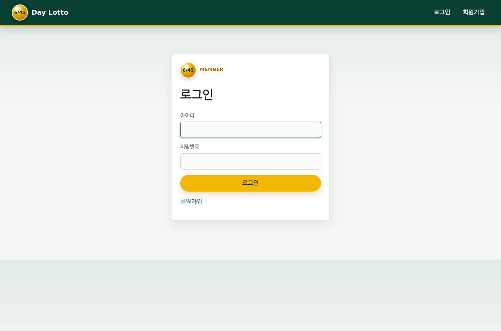
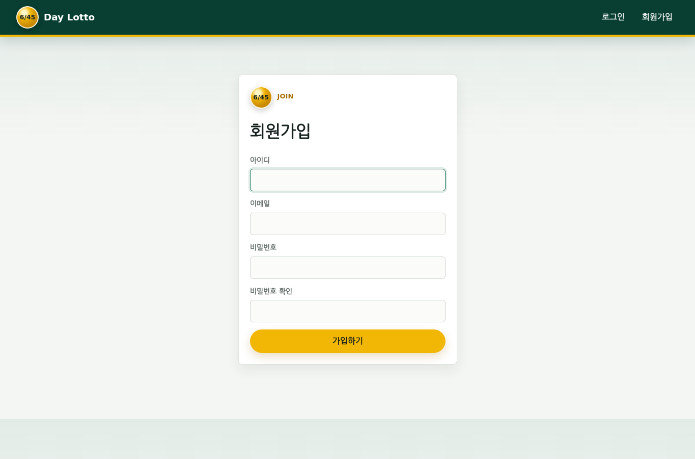
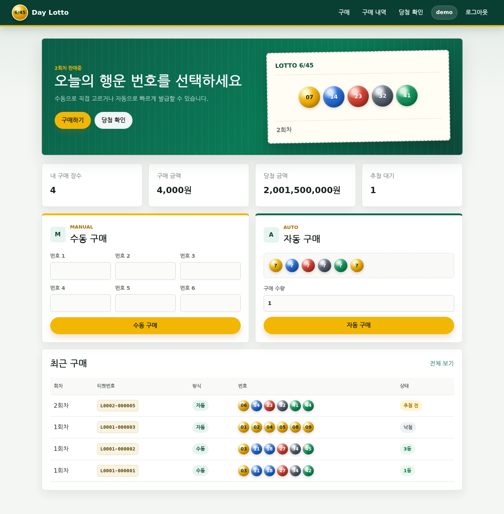
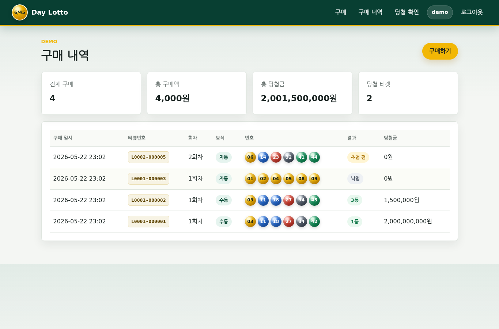
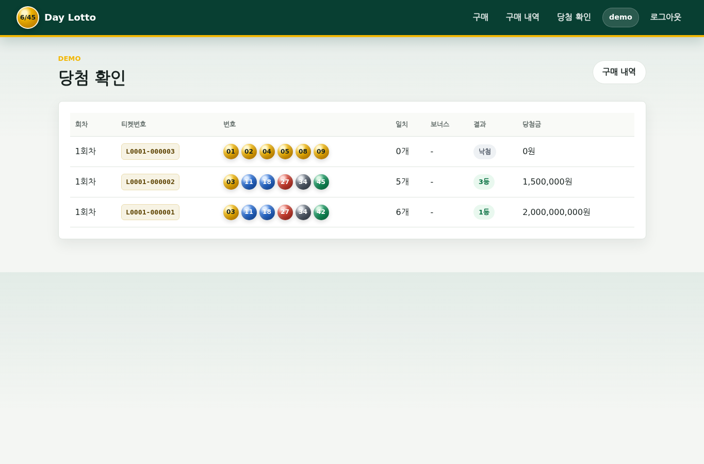
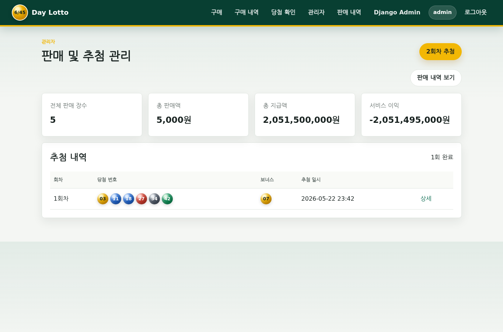
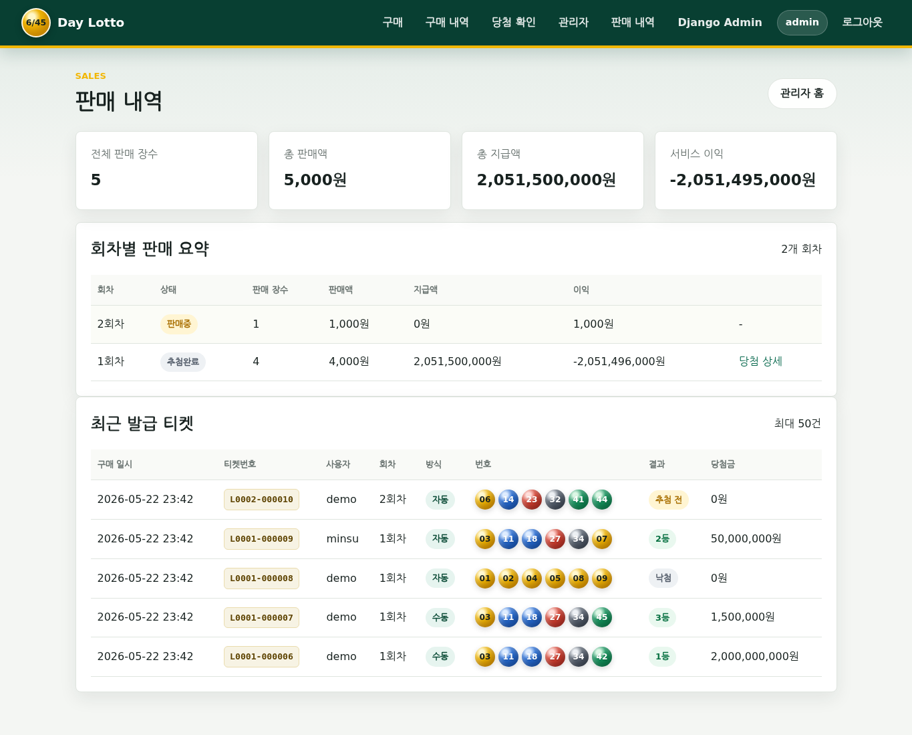
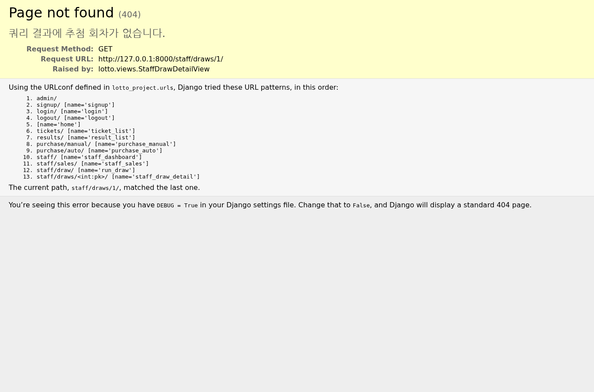

# 6/45 Lotto 웹 사이트 개발 보고서

## 1. 프로젝트 개요

본 프로젝트는 Django와 Docker를 사용하여 구현한 6/45 로또 웹 사이트이다. 일반 사용자는 회원가입과 로그인 후 수동 또는 자동으로 로또를 구매할 수 있고, 추첨 완료 후 본인의 당첨 여부를 확인할 수 있다. 관리자는 판매 현황, 판매 내역, 추첨 기능, 회차별 당첨자 수, 판매액, 지급액, 이익을 확인할 수 있다.

소스 코드는 다음 GitHub 저장소에 업로드했다.

```text
https://github.com/iamdbstjd/OS_LOTTO
```

## 2. 주요 요구사항 반영

### 사용자 기능

- 회원가입 및 로그인
- 사용자별 구매 기록 저장
- 수동 구매: 사용자가 1부터 45 사이의 번호 6개를 직접 입력
- 자동 구매: 시스템이 1부터 45 사이의 중복 없는 번호 6개를 자동 생성
- 티켓번호 발급: 각 구매 건에 `L0001-000001` 형식의 고유 티켓번호 부여
- 사용자 요약: 전체 구매 장수, 총 구매액, 총 당첨금, 추첨 대기 건수 확인
- 구매 내역 확인: 로그인한 사용자 본인의 티켓만 조회
- 당첨 확인: 추첨 완료 회차의 일치 개수, 보너스 일치 여부, 등수, 당첨금 확인

### 관리자 기능

- 전체 판매 장수 확인
- 총 판매액, 총 지급액, 서비스 이익 확인
- 현재 판매중 회차 추첨 실행
- 회차별 판매 장수, 판매액, 지급액, 이익 확인
- 최근 발급 티켓의 사용자, 티켓번호, 번호, 결과 확인
- 회차별 1등, 2등, 3등, 4등, 5등 인원 확인
- 회차별 구매자 당첨 내역 확인

### Docker 요구사항

서비스는 Docker multi-container 구조로 구성했다.

- `web`: Django 애플리케이션 컨테이너
- `db`: PostgreSQL 데이터베이스 컨테이너
- `postgres_data`: DB 데이터를 유지하는 Docker volume

## 3. 시스템 설계

### 아키텍처

```text
Browser
  |
  v
web container
  Django views / forms / services / templates
  |
  v
db container
  PostgreSQL
```

Django 애플리케이션은 화면 출력, 로그인 세션, 구매 처리, 추첨 처리, 당첨 계산을 담당한다. PostgreSQL 컨테이너는 사용자, 회차, 티켓, 당첨 결과 데이터를 저장한다.

로컬 테스트 편의를 위해 `DB_HOST` 환경 변수가 없으면 SQLite를 사용하고, Docker Compose 실행 시에는 `DB_HOST=db`가 설정되어 PostgreSQL을 사용한다.

### 데이터 모델

#### Draw

`Draw` 모델은 로또 회차를 나타낸다.

- `round_number`: 회차 번호
- `status`: 판매중 또는 추첨완료
- `winning_numbers`: 당첨 번호 6개
- `bonus_number`: 보너스 번호
- `drawn_at`: 추첨 일시

#### Ticket

`Ticket` 모델은 사용자가 구매한 로또 티켓을 나타낸다.

- `user`: 구매 사용자
- `draw`: 구매한 회차
- `ticket_code`: 구매 건을 추적하기 위한 고유 티켓번호
- `numbers`: 구매 번호 6개
- `purchase_type`: 수동 또는 자동
- `price`: 구매 금액
- `match_count`: 당첨 번호와 일치한 개수
- `matched_bonus`: 보너스 번호 일치 여부
- `prize_rank`: 당첨 등수
- `prize_amount`: 당첨금

### 당첨 판정 기준

실제 로또 규칙을 기준으로 등수를 계산했다.

| 등수 | 조건 |
| --- | --- |
| 1등 | 당첨 번호 6개 일치 |
| 2등 | 당첨 번호 5개 + 보너스 번호 일치 |
| 3등 | 당첨 번호 5개 일치 |
| 4등 | 당첨 번호 4개 일치 |
| 5등 | 당첨 번호 3개 일치 |

당첨금은 과제 시연과 이익 계산을 단순하게 하기 위해 고정 금액으로 설정했다.

| 등수 | 당첨금 |
| --- | ---: |
| 1등 | 2,000,000,000원 |
| 2등 | 50,000,000원 |
| 3등 | 1,500,000원 |
| 4등 | 50,000원 |
| 5등 | 5,000원 |

서비스 이익은 다음 공식으로 계산했다.

```text
서비스 이익 = 총 판매액 - 총 지급액
```

## 4. 화면 및 기능 설명

아래 화면은 제출 보고서 설명을 위해 데모 데이터로 캡처했다.

<section class="screen-shot-block">
<h3>4.1 로그인 화면</h3>

</section>

로그인 화면에서는 기존 사용자가 아이디와 비밀번호를 입력해 서비스에 접속한다.

- `로그인` 버튼 클릭: 입력한 계정 정보를 Django 인증 시스템으로 검증한다.
- 인증 성공 시: 로또 구매 메인 화면으로 이동한다.
- 인증 실패 시: 로그인 화면에 오류가 표시된다.
- `회원가입` 링크 클릭: 회원가입 화면으로 이동한다.

<section class="screen-shot-block">
<h3>4.2 회원가입 화면</h3>

</section>

회원가입 화면에서는 신규 사용자가 아이디, 이메일, 비밀번호를 입력한다.

- `가입하기` 버튼 클릭: Django `UserCreationForm` 기반으로 사용자를 생성한다.
- 가입 성공 시: 자동 로그인 후 로또 구매 메인 화면으로 이동한다.
- 비밀번호 조건 불충족 또는 중복 아이디 입력 시: 폼 오류를 표시한다.

<section class="screen-shot-block">
<h3>4.3 사용자 메인 및 구매 화면</h3>

</section>

사용자 메인 화면은 현재 판매중인 회차, 사용자 구매 요약, 수동 구매, 자동 구매, 최근 구매 내역을 보여준다.

- 상단 `구매하기` 버튼 클릭: 화면 아래 구매 영역으로 이동한다.
- 상단 `당첨 확인` 버튼 클릭: 당첨 확인 페이지로 이동한다.
- `수동 구매` 영역:
  - 사용자가 번호 1부터 번호 6까지 직접 입력한다.
  - `수동 구매` 버튼 클릭 시 번호 6개가 저장된다.
  - 중복 번호 또는 1~45 범위 밖 번호를 입력하면 오류가 표시된다.
- `자동 구매` 영역:
  - 구매 수량을 입력한다.
  - `자동 구매` 버튼 클릭 시 시스템이 중복 없는 번호 6개를 자동 생성한다.
  - 한 번에 1장부터 5장까지 구매할 수 있다.
- 최근 구매 영역:
  - 티켓번호, 구매 방식, 번호, 추첨 전/당첨/낙첨 상태를 확인할 수 있다.

<section class="screen-shot-block">
<h3>4.4 사용자 구매 내역 화면</h3>

</section>

구매 내역 화면은 로그인한 사용자 본인의 티켓만 표시한다.

- `구매하기` 버튼 클릭: 구매 메인 화면으로 돌아간다.
- 티켓번호: 각 구매 건을 식별하는 고유 번호이다.
- 방식: 수동 구매인지 자동 구매인지 표시한다.
- 번호: 구매한 6개 번호를 로또 볼 형태로 표시한다.
- 결과: 추첨 전, 낙첨, 1등~5등을 표시한다.
- 당첨금: 추첨 후 계산된 당첨 금액을 표시한다.

<section class="screen-shot-block">
<h3>4.5 사용자 당첨 확인 화면</h3>

</section>

당첨 확인 화면은 추첨이 완료된 회차의 티켓만 보여준다.

- `구매 내역` 버튼 클릭: 전체 구매 내역 화면으로 이동한다.
- 일치: 당첨 번호와 사용자의 구매 번호가 몇 개 일치했는지 표시한다.
- 보너스: 보너스 번호 일치 여부를 표시한다.
- 결과: 로또 등수 또는 낙첨을 표시한다.
- 당첨금: 등수별 고정 당첨금을 표시한다.

<section class="screen-shot-block">
<h3>4.6 관리자 대시보드 화면</h3>

</section>

관리자 대시보드는 전체 판매 현황과 추첨 기능을 제공한다.

- `2회차 추첨` 버튼 클릭:
  - 현재 판매중 회차의 당첨 번호 6개와 보너스 번호를 생성한다.
  - 해당 회차의 모든 티켓을 평가한다.
  - 티켓별 일치 개수, 보너스 일치 여부, 당첨 등수, 당첨금을 저장한다.
  - 추첨 완료 후 다음 회차를 새로 생성한다.
  - 추첨 상세 화면으로 이동한다.
- `판매 내역 보기` 버튼 클릭: 관리자 판매 내역 화면으로 이동한다.
- 전체 판매 장수, 총 판매액, 총 지급액, 서비스 이익을 확인할 수 있다.
- 추첨 내역 표에서 `상세`를 클릭하면 해당 회차의 당첨 상세 화면으로 이동한다.

<section class="screen-shot-block">
<h3>4.7 관리자 판매 내역 화면</h3>

</section>

판매 내역 화면은 관리자 전용 화면이며 회차별 판매 요약과 최근 발급 티켓을 보여준다.

- 회차별 판매 요약:
  - 회차 상태, 판매 장수, 판매액, 지급액, 이익을 확인한다.
  - 추첨 완료 회차의 `당첨 상세` 링크를 클릭하면 회차별 당첨 상세 화면으로 이동한다.
- 최근 발급 티켓:
  - 구매 일시, 티켓번호, 사용자, 회차, 구매 방식, 번호, 결과, 당첨금을 확인한다.
  - 관리자가 실제 판매 내역을 추적할 수 있도록 티켓 단위로 표시한다.

<section class="screen-shot-block">
<h3>4.8 관리자 당첨 상세 화면</h3>

</section>

관리자 당첨 상세 화면은 특정 회차의 추첨 결과와 구매자별 결과를 보여준다.

- 당첨 번호: 해당 회차의 당첨 번호 6개와 보너스 번호를 표시한다.
- 판매액: 해당 회차의 전체 판매 금액이다.
- 이익: 판매액에서 지급액을 뺀 값이다.
- 등수별 요약: 1등부터 5등까지 당첨자 수와 등수별 당첨금을 표시한다.
- 구매자별 결과:
  - 사용자, 티켓번호, 번호, 일치 개수, 보너스 일치 여부, 결과, 당첨금을 표시한다.

## 5. 구현 과정

### 1단계: 프로젝트 구조 생성

Django 프로젝트 `lotto_project`와 앱 `lotto`를 생성하고, 사용자 화면과 관리자 화면을 위한 URL, view, form, template 구조를 구성했다.

### 2단계: 인증 기능 구현

Django 기본 인증 시스템을 사용하여 회원가입, 로그인, 로그아웃을 구현했다. 로그인한 사용자만 구매, 구매 내역, 당첨 확인 페이지에 접근할 수 있다. 관리자 기능은 `is_staff` 권한을 가진 사용자만 접근할 수 있다.

### 3단계: 구매 기능 구현

수동 구매는 `ManualTicketForm`에서 6개 번호를 입력받고, 중복 여부와 1~45 범위를 검증한다. 자동 구매는 `random.sample`을 사용해 중복 없는 번호 6개를 생성한다.

티켓 저장 시 `L0001-000001` 형식의 고유 티켓번호를 자동 발급하여 사용자와 관리자가 동일한 구매 건을 쉽게 확인할 수 있도록 했다.

### 4단계: 추첨 및 당첨 계산 구현

관리자가 추첨 버튼을 누르면 현재 판매중인 회차의 당첨 번호 6개와 보너스 번호가 생성된다. 이후 해당 회차의 모든 티켓을 평가하여 일치 개수, 보너스 일치 여부, 등수, 당첨금을 저장한다. 추첨 완료 후 다음 회차를 자동 생성한다.

### 5단계: 사용자/관리자 통계 고도화

사용자 화면에는 본인의 전체 구매 장수, 구매 금액, 당첨 금액, 추첨 대기 건수를 표시했다. 관리자 화면에는 전체 요약뿐 아니라 회차별 판매 요약과 최근 발급 티켓 목록을 제공하여 판매 내역 확인 요구사항을 명확하게 충족하도록 했다.

### 6단계: Docker multi-container 구성

`docker-compose.yml`에 Django `web` 서비스와 PostgreSQL `db` 서비스를 정의했다. `db` 서비스에는 healthcheck를 추가하여 DB 준비가 끝난 뒤 Django 마이그레이션과 서버 실행이 진행되도록 했다.

## 6. 실행 방법

Docker 환경에서 다음 명령을 실행한다.

```bash
docker compose up --build
```

웹 브라우저에서 다음 주소로 접속한다.

```text
http://localhost:8000
```

관리자 기능을 사용하려면 다음 명령으로 관리자 계정을 생성한다.

```bash
docker compose exec web python manage.py createsuperuser
```

## 7. 테스트 결과

다음 테스트를 작성했다.

- 번호 정렬 및 중복 번호 검증
- 수동 구매 시 현재 판매중 회차에 티켓 생성
- 자동 구매 번호 생성 검증
- 1등~5등 및 낙첨 판정 검증
- 추첨 실행 후 티켓 평가 및 다음 회차 생성 검증
- 회원가입 후 로그인 흐름 검증
- 로그인 사용자 수동 구매 흐름 검증
- 관리자 추첨 실행 검증
- 관리자 대시보드 렌더링 검증
- 관리자 판매 내역 렌더링 및 티켓번호 표시 검증
- 관리자 당첨 상세 화면 번호 볼 렌더링 검증
- 일반 사용자 관리자 추첨 차단 검증

실행한 검증 명령은 다음과 같다.

```bash
docker compose config
conda run -n bys python manage.py check
conda run -n bys python manage.py test
```

검증 결과는 다음과 같다.

```text
System check identified no issues (0 silenced).
Ran 12 tests in 6.013s
OK
```

`docker compose config` 명령으로 `docker-compose.yml` 문법과 서비스 구성을 확인했다.

## 8. AI 도구 사용 내역

본 프로젝트 작성 과정에서 AI 도구를 사용했다.

- 사용 도구: OpenAI Codex / ChatGPT
- 사용 목적:
  - 과제 요구사항 분석
  - Django 모델, view, form, template 구조 설계
  - Docker multi-container 구성 작성
  - 로또 당첨 판정 로직 구현 보조
  - 사용자/관리자 화면 UI 개선 보조
  - 테스트 코드 작성 보조
  - 보고서 초안 및 화면 설명 작성 보조
- 사용자가 직접 결정한 사항:
  - 회원가입/로그인을 포함한 사용자별 구매 기록 시스템으로 구현
  - GitHub 저장소 주소 지정
  - MIT License 적용

## 9. 한계 및 개선 가능 사항

- 실제 로또처럼 판매액 기반으로 당첨금을 동적으로 배분하지 않고, 과제 시연용 고정 당첨금을 사용했다.
- 결제 기능은 구현하지 않았고, 구매 버튼을 누르면 티켓이 발급되는 방식이다.
- 관리자 화면은 과제에 필요한 판매/추첨/당첨 확인 중심으로 구성했으며, 더 복잡한 통계 차트는 포함하지 않았다.
- 배포 운영 환경에서는 `DJANGO_SECRET_KEY`, `DJANGO_DEBUG`, `DJANGO_ALLOWED_HOSTS`를 안전하게 변경해야 한다.

## 10. 라이선스

본 프로젝트는 MIT License를 사용한다.
